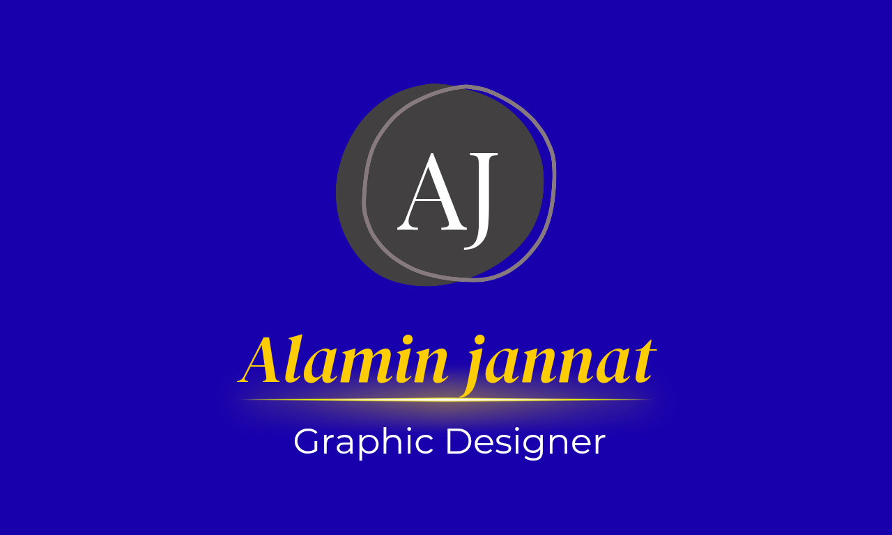

<!DOCTYPE html>
<html>
<head>
<title>Alamin Portfolio</title>

</head>

<body>

<link href="https://unpkg.com/aos@2.3.1/dist/aos.css" rel="stylesheet">

  <h1>Alamin</h1>
  

<link rel="stylesheet"
href="https://cdnjs.cloudflare.com/ajax/libs/font-awesome/6.5.1/css/all.min.css">

<nav>
<h2>Alamin</h2>

<ul>
<li><a href="#home">Home</a></li>
<li><a href="#about">About</a></li>
<li><a href="#services">Services</a></li>
<li><a href="#contact">Contact</a></li>
</ul>

</nav>

    

<section id="home">

     <h2 class="typing-text">
  I'm a 
</h2>

    

        I create responsive and modern websites for
        businesses and personal brands.
    

</section>

    <button class="btn">Hire Me</button>
    <button class="btn2">View Work</button>

<section id="about" data-aos="fade-up">
<section class="about">
<section id="about">
    <h2>About Me</h2>

    

        I am a modern web designer. I create responsive,
        beautiful and user friendly websites for businesses
        and personal brands.
    

</section>
<section id="services" data-aos="zoom-in">
<section class="services">

    <h2>My Services</h2>
    <section id="services">

    

        <h3>Web Design</h3>
        
I create modern and responsive websites.

    

    

        <h3>UI Design</h3>
        
Beautiful user interface with premium look.

    

    

        <h3>Responsive Design</h3>
        
Mobile friendly websites for all devices.

    

</section>

<section id="projects">

<h2 class="project-title">My Projects</h2>

<h3>Business Website</h3>

Modern responsive business landing page.

<a href="#">Live Preview</a>

<h3>Portfolio Website</h3>

Personal portfolio with premium UI.

<a href="#">Live Preview</a>

</section>

<section class="skills" id="skills">
  <h2>My Skills</h2>

  
HTML

  

  
CSS

  

  
JavaScript

  

    
UI/UX Design

    

        
    

    
WordPress

    

        
    

</section>

<section id="pricing">

<h2 class="pricing-title">Pricing Plans</h2>

<h3>Basic</h3>

<h1>$20</h1>

✔ Responsive Design

✔ 1 Page Website

✔ Mobile Friendly

✔ Fast Delivery

<a href="#">Order Now</a>

POPULAR

<h3>Standard</h3>

<h1>$50</h1>

✔ 3 Pages Website

✔ Premium Design

✔ Animation Effects

✔ SEO Friendly

✔ Fast Support

<a href="#">Order Now</a>

<h3>Premium</h3>

<h1>$100</h1>

✔ Full Website

✔ Custom UI/UX

✔ Advanced Animation

✔ Admin Panel

✔ Lifetime Support

<a href="#">Order Now</a>

</section>

<section id="contact" data-aos="fade-up">
<section class="contact">
<section id="contact">

    <h2>Contact Me</h2>

Have a project? Let’s work together.

    
📧 alamin.web@gmail.com

    <a href="https://wa.me/60173544155" target="_blank">
        WhatsApp Me
    </a>

    

<a href="https://facebook.com/" target="_blank">
<i class="fab fa-facebook-f"></i>
</a>

<a href="https://github.com/" target="_blank">
<i class="fab fa-github"></i>
</a>

<a href="https://wa.me/60173544155" target="_blank">
<i class="fab fa-whatsapp"></i>
</a>

<a href="https://tiktok.com/" target="_blank">
<i class="fab fa-tiktok"></i>
</a>

</section>

<a href="https://wa.me/60173544155" class="floating-whatsapp" target="_blank">
<i class="fab fa-whatsapp"></i>
</a>

<button id="topBtn">↑</button>

<footer class="footer">

    <h2>Alamin</h2>

    
Professional Web Designer & Developer

    

        <a href="#home">Home</a>
        <a href="#about">About</a>
        <a href="#services">Services</a>
        <a href="#contact">Contact</a>
    

    

        © 2025 Alamin. All Rights Reserved.
    

</footer>

</body>
</html>
